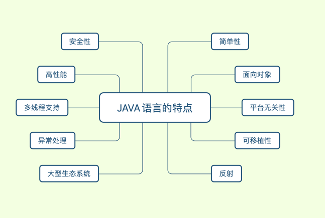
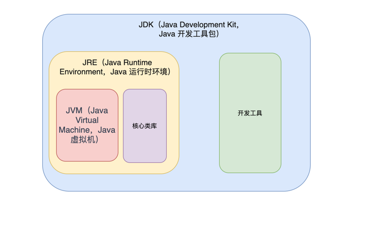

# java基础问题汇总讨论  
**最近在准备后端开发岗位的面试，在准备阶段和面试结束后，遇到了很多问题，想找到问题的答案有的时候会花费大量的时间。但是找同事或者朋友去讨论这个问题，能够很快的得到问题的答案。我希望通过这个项目让java学习者提出自己的问题，并一起讨论**
## java概念
>  ### 什么是java？【[知乎讨论链接](https://www.zhihu.com/question/603138287)】
仅仅回答java是一种编程语言，肯定是不够的，能多说尽量多说，尽量强调一下java的特性
Java是一种通用的编程语言，由Sun Microsystems（现在是Oracle Corporation）于1995年发布。它被设计成一种具有高度可移植性、面向对象和强类型的语言，广泛用于开发各种类型的应用程序，包括桌面应用程序、移动应用程序、企业级应用程序、嵌入式系统和大型互联网应用程序。   
Java具有以下特点：  
可移植性：Java程序可以在不同的操作系统和硬件平台上运行，只需要在目标平台上安装适当的Java虚拟机（JVM）。   
面向对象：Java是一种面向对象的编程语言，支持面向对象的编程范式，包括封装、继承和多态。   
简单性：Java的语法相对简单且易于理解，减少了常见编程错误的可能性。   
安全性：Java提供了安全性机制，包括内置的安全性检查和沙箱环境，以防止恶意代码的执行。   
多线程支持：Java具有内置的多线程支持，可以轻松地创建和管理多线程应用程序。   
大型标准库：Java拥有丰富的标准类库，提供了许多用于常见任务的预定义类和方法，简化了开发过程。   
垃圾回收：Java自动进行垃圾回收，开发人员不需要手动管理内存。  
Java有许多应用领域，其中最知名的是在Web开发中使用Java Enterprise Edition（Java EE）来构建企业级应用程序，以及在Android平台上开发移动应用程序。此外，Java还被广泛应用于服务器端开发、大数据处理、科学计算和游戏开发等领域。
>  ### Java有哪些特性？【[知乎讨论链接](https://www.zhihu.com/question/603145981/answer/3045626759)】

java具有以下主要特性：   
简单性：Java采用清晰且简洁的语法，减少了编程中的冗余和复杂性。它遵循面向对象的编程原则，提供了易于理解和使用的类库和API。  
面向对象：Java是一种面向对象的编程语言，支持封装、继承和多态等面向对象的概念。它允许开发人员以对象的方式组织和管理代码，提供了良好的代码结构和可重用性。  
平台无关性：Java的最大优势之一是它的平台无关性。Java代码编译后生成的是字节码（Bytecode），可以在任何支持Java虚拟机（JVM）的平台上运行，包括Windows、Linux、Mac等。  
可移植性：由于Java是平台无关的，可以将Java应用程序轻松地从一个平台移植到另一个平台，而无需对源代码进行修改。这为跨平台开发和部署提供了便利。  
安全性：Java在设计上具有强大的安全性特性。它提供了安全管理器（Security Manager）来控制Java应用程序的安全访问，防止恶意代码的执行，确保应用程序在受控的环境中运行。  
高性能：尽管Java是解释型语言，但它通过即时编译（Just-In-Time Compilation）和优化技术提供了出色的性能。Java的高性能使其成为处理大规模和高并发应用的理想选择。  
多线程支持：Java内置了对多线程编程的支持。开发人员可以轻松地创建和管理多线程应用程序，实现并发处理和任务分配。  
大型生态系统：Java拥有丰富的类库和框架，构成了一个庞大而活跃的生态系统。这些类库和框架提供了广泛的功能，包括网络编程、数据库连接、图形用户界面、安全性等，极大地提高了开发效率。  
异常处理：Java具有强大的异常处理机制，允许开发人员捕获和处理程序运行过程中的异常情况。这有助于提高代码的健壮性和可靠性。  
反射：Java的反射机制允许在运行时动态地获取和操作类的信息。开发人员可以通过反射实现动态创建对象、调用方法、访问字段等功能，为编写灵活和可扩展的代码提供了支持。  
这些特性使Java成为一种广泛应用于企业级应用开发、移动应用开发和云计算等领域的强大编程语言。
>  ### JVM、JDK 和 JRE 有什么区别？【[知乎讨论链接](https://www.zhihu.com/question/603149042)】

JVM、JDK 和 JRE 是与 Java 编程语言相关的术语，它们在 Java 开发中扮演着不同的角色。以下是它们的区别：   
JVM（Java Virtual Machine，Java 虚拟机）：JVM 是一个虚拟计算机，它是 Java 程序运行的环境。JVM 负责将 Java 字节码（由 Java 编译器生成）解释成特定计算机系统的机器指令，以便程序能够在不同的操作系统和硬件平台上运行。JVM 还提供了内存管理、垃圾回收和安全等功能，使得 Java 程序具有跨平台的特性。   
JDK（Java Development Kit，Java 开发工具包）：JDK 是用于 Java 应用程序开发的软件包。它包含了编译器、调试器、各种工具和类库，以及用于开发和调试 Java 应用程序的其他组件。JDK 中的编译器将 Java 源代码编译成字节码，并提供了开发 Java 应用程序所需的各种工具和资源。   
JRE（Java Runtime Environment，Java 运行时环境）：JRE 是一个运行 Java 应用程序所需的最小环境。它包含了 JVM 和 Java 类库，以及支持 Java 应用程序运行所需的其他文件和配置。使用 JRE，可以在计算机上运行已经编译成字节码的 Java 应用程序，而不需要进行开发或编译。  
简而言之，JVM 是负责执行 Java 字节码的虚拟机，JDK 是用于开发 Java 应用程序的工具包，而 JRE 则是运行已编译 Java 应用程序所需的最小环境。
