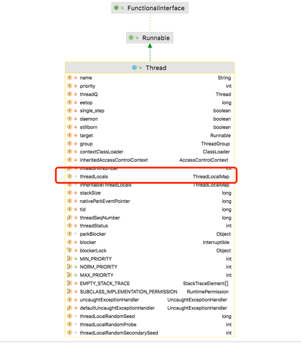

# 多线程问题汇总讨论  
**最近在准备后端开发岗位的面试，在准备阶段和面试结束后，遇到了很多问题，想找到问题的答案有的时候会花费大量的时间。但是找同事或者朋友去讨论这个问题，能够很快的得到问题的答案。我希望通过这个项目让java学习者提出自己的问题，并一起讨论**
##基础问题
>##并行跟并发有什么区别？【[知乎讨论链接](https://www.zhihu.com/question/608650446) 】 

在计算机科学中，"并行"和"并发"是两个相关但具有不同含义的概念。
并行（Parallelism）是指同时执行多个任务或操作。当系统具有多个处理单元（如多核处理器或分布式计算系统）时，可以同时执行多个任务，每个任务在不同的处理单元上运行。并行可以显著提高系统的处理能力和效率。
并发（Concurrency）是指在一个时间段内执行多个任务或操作。这些任务可能在同一个处理单元上交替执行，也可能在多个处理单元上并行执行。并发通常用于处理多个独立的任务或操作，并通过合理的任务调度和资源管理来实现更高的效率。
区别总结如下：
并行是指同时执行多个任务，利用多个处理单元同时进行工作。
并发是指在一个时间段内执行多个任务，这些任务可能在同一个处理单元上交替执行，也可能在多个处理单元上并行执行。
并行更强调同时性和同时处理多个任务的能力。
并发更强调任务的交替执行和任务调度的能力。
需要注意的是，并行和并发的概念并不是互斥的，它们可以同时存在。在某些情况下，可以同时利用并行和并发来提高系统的性能和响应能力。
  
>##说说什么是进程和线程？【[知乎讨论链接](https://www.zhihu.com/question/603099141) 】 

进程（Process）和线程（Thread）是计算机科学中两个重要的概念，用于描述程序执行的基本单位。
进程是操作系统中一个正在执行的程序实例。每个进程都有自己的地址空间、内存、文件描述符、资源和状态。一个进程可以由一个或多个线程组成。进程之间相互独立，拥有各自的资源和内存空间，通过进程间通信（IPC）机制来进行数据交换和同步。
线程是进程中的一个执行单元。一个进程可以包含多个线程，这些线程共享进程的资源和上下文。线程拥有自己的栈空间和程序计数器，但共享进程的内存空间、文件描述符和其他系统资源。多线程可以同时执行不同的任务，提高程序的并发性和效率。
进程和线程之间有一些区别和关系：
资源开销：创建和维护进程的资源开销较大，而线程的资源开销较小，因为它们共享了进程的资源。
并发性：多个线程可以在同一时间内并发执行，而多个进程需要进行进程切换，实现并发执行。
通信和同步：在同一进程内的线程可以直接共享数据，通信和同步比较容易。而进程之间的通信需要使用特定的IPC机制，如管道、套接字、共享内存等。
容错性：一个线程的异常可能会导致整个进程的崩溃，但是在多进程环境中，一个进程的崩溃不会影响其他进程的运行。
执行方式：在多核处理器上，多个线程可以在不同的核心上并行执行，而进程只能在一个核心上执行。
总结来说，进程是操作系统中资源分配的基本单位，而线程是进程中执行的最小单位。进程用于实现程序的隔离和资源管理，线程用于实现程序的并发执行和任务的划分。
  
相关讨论问题：协程了解吗？/java是否可以创建子进程？
>##说说线程有几种创建方式？
创建线程的方式主要有以下几种：

1. 继承Thread类：通过继承`java.lang.Thread`类创建线程。需要重写Thread类中的`run()`方法，该方法包含线程的执行逻辑。然后创建子类的实例，并调用`start()`方法启动线程。

```java
class MyThread extends Thread {
    public void run() {
        // 线程的执行逻辑
    }
}

// 创建线程并启动
MyThread thread = new MyThread();
thread.start();
```

2. 实现Runnable接口：通过实现`java.lang.Runnable`接口创建线程。需要创建一个实现`run()`方法的类，并将其作为参数传递给`Thread`类的构造函数。然后创建`Thread`对象，并调用`start()`方法启动线程。

```java
class MyRunnable implements Runnable {
    public void run() {
        // 线程的执行逻辑
    }
}

// 创建线程并启动
MyRunnable runnable = new MyRunnable();
Thread thread = new Thread(runnable);
thread.start();
```

3. 使用Callable和Future：通过实现`java.util.concurrent.Callable`接口创建线程。`Callable`接口允许线程返回一个结果，并可以通过`java.util.concurrent.Future`接口获取线程执行的结果。

```java
import java.util.concurrent.Callable;
import java.util.concurrent.FutureTask;

class MyCallable implements Callable<Integer> {
    public Integer call() throws Exception {
        // 线程的执行逻辑
        return 42;
    }
}

// 创建线程并启动
MyCallable callable = new MyCallable();
FutureTask<Integer> futureTask = new FutureTask<>(callable);
Thread thread = new Thread(futureTask);
thread.start();

// 获取线程的执行结果
int result = futureTask.get();
```

4. 使用Executor框架：通过`java.util.concurrent.Executor`和`java.util.concurrent.ExecutorService`接口，以及相关的实现类，如`ThreadPoolExecutor`，可以使用线程池来管理和复用线程。通过`submit()`方法提交实现`Runnable`或`Callable`接口的任务，线程池会自动调度任务的执行。

```java
import java.util.concurrent.ExecutorService;
import java.util.concurrent.Executors;

ExecutorService executor = Executors.newFixedThreadPool(5);
executor.execute(new Runnable() {
    public void run() {
        // 线程的执行逻辑
    }
});
executor.shutdown();
```

这些是常见的创建线程的方式，每种方式都适用于不同的场景。选择适合的方式取决于具体的需求和编程风格。另外，Java 8及以上版本还引入了函数式编程特性，可以使用Lambda表达式来简化线程的创建和执行，使代码更加简洁。

>##线程有哪些常用的调度方法?  

>##ThreadLocal使用过吗？使用过程中存在什么问题？
ThreadLocal感觉是个老大难问题，平常不怎么使用，但是面试却被经常问，之前一直不理解ThreadLocal到底是怎么实现的，其实搞清楚这几个类的关系，就很好理解了。
（1）Thread
  
首先看Thread,里面是包含两个成员变量的。
ThreadLocal.ThreadLocalMap threadLocals和ThreadLocal.ThreadLocalMap inheritableThreadLocals
这两个都是ThreadLocal.ThreadLocalMap，我们先忽略inheritableThreadLocals，主要关注threadLocals
我们创建一个线程，就会有一个threadLocals，但是它是没有初始化的，具体初始化在什么地方呢？
    
从调用关系上看，是在ThreadLocal里面初始化的，方法名称为createMap
    
再往上跟踪，就是set和get两个方法中会调用createMap，如果使用过ThreadLocal的同学，一定就很了解ThreadLocal中的set和get方法了。  
因此，能够得出结论，thread中threadLocals是在线程内第一次使用ThreadLocal的时候初始化的。
（2）ThreadLocal
ThreadLocalMap是ThreadLocal中静态内部类，为什么会把ThreadLocalMap放到ThreadLocal中呢？可以思考一下（https://ask.csdn.net/questions/730831）
  
ThreadLocalMap里面主要是Entry[] table;这里的Entry又是ThreadLocalMap的静态内部类，然后Entry又是继承自弱引用WeakReference<ThreadLocal<?>>，开始看这个结构，确实让人摸不着头脑，但是你把这几个内部类看做是单独的类，可能就好理解一些。
    
这几个类的具体关系基本就是这样：
  
具体数据储存的结构是这样：
  
ThreadA初始化threadLocal1、threadLocal2、threadLocal3的过程是这样：
  
梳理到这个地方，其实还是有很多疑问的。
疑问一：Entry[] table中的Entry其实是有一个key和value的，key作为软引用（threadLocal），如果在运行过程中发生gc,key被回收了是否会存在问题？
答案：没有问题的
这是因为key作为软引用（threadLocal），指向了我们定义的threadLocal，但是主线程中还存在指向threadLocal的强引用，是没办法被回收的。
疑问二：Thread中的threadLocalMap是随着Thread的结束，引用就会消失，应该不会导致内存泄露啊？为什么会说threadLocal容易导致内存泄露？
答案：Thread结束运行确实不会存在内存泄露的问题，但是我们在实际项目开发过程中，更多的时候是使用线程池来管理线程，核心线程一般会重复利用，这个时候threadLocalMap就会一直存在引用。这个时候就会存在内存泄露的问题。
疑问三：threadLocal是怎么导致内存泄露的？
答案：存在两个问题，第一个问题：是threadLocalMap中的entry[] table，中entry的key是主线程的threadLocal，当主线程（主线程可能是非核心线程，子线程是核心线程）被回收，对应的主线程对threadLocal的强引用就没有了。但是entry的key还引用着threadLocal，  
如果threadLocal比较大，那么可能就会存在内存泄露。（说白了就是这个key不需要了，但是threadLocalMap中还存储着）目前entry的key是软引用，一旦发生gc就可以回收。
第二个问题：key可以被回收，value怎么办呢？
【ThreadLocalMap.key到期之'探测是清理'+'启发式清理'流程(https://www.cnblogs.com/lihw/p/17215370.html)】
具体可以看看上面这个博客，从中可以看出在set\get\rehash的时候都会去清理key为null的entry,但是这种清理不一定能清理完全，并且需要依赖其他方法才能触发，仍然存在内存泄露的可能。避免内存泄露最好的方式就是再使用后remove一下。
>##线程池的原理，是什么/核心线程是否会被回收/怎么保证核心线程不回收/怎么自动回收核心线程？【[知乎讨论链接](https://www.zhihu.com/question/603099141)】(该问题可以从以下几个方面解答)
>##线程池的核心参数有哪些？
首先说一下多线程的几个核心参数。  
1.corePoolSize:核心线程大小  线程池中，线程保活的最大数量（思考：核心线程是否可以回收？） 
2.maximumPoolSize：最大线程大小 （思考：一个线程怎么能区分其是核心线程还是非核心线程？非核心线程是怎么回收的？）  
3.keepAliveTime：线程的空闲的最大时间（思考：怎么判断线程空闲的时间）  
4.unit：超时（上面第三个参数的）的时间单位  
5.workQueue（BlockingQueue<Runnable>）：工作队列，这里的工作队列和内部类Worker不太一样，Worker可以理解成工作人员，workQueue是任务队列  
6.threadFactory：线程工厂,主要实现newThread方法就可以，一般 使用Executors中自带的DefaultThreadFactory
>##线程池的运行流程（原理）？
线程池运行的整体流程：  

>##核心线程是否会被回收？ 
想要了解这个问题需要理解  
1.线程池是否能区分出核心线程和非核心线程？   
2.线程是怎么被回收的？  
回答1：线程池是无法区分出核心线程和非核心线程
具体可以看一下worker里面的属性，并没有专门的属性区分核心线程和非核心线程

回答2：
具体看一下worker内部方法--runWorker

```java
    final void runWorker(Worker w) {
        Thread wt = Thread.currentThread();
        Runnable task = w.firstTask;
        w.firstTask = null;
        w.unlock(); // allow interrupts
        boolean completedAbruptly = true;
        try {
            while (task != null || (task = getTask()) != null) {
                w.lock();
                // If pool is stopping, ensure thread is interrupted;
                // if not, ensure thread is not interrupted.  This
                // requires a recheck in second case to deal with
                // shutdownNow race while clearing interrupt
                if ((runStateAtLeast(ctl.get(), STOP) ||
                     (Thread.interrupted() &&
                      runStateAtLeast(ctl.get(), STOP))) &&
                    !wt.isInterrupted())
                    wt.interrupt();
                try {
                    beforeExecute(wt, task);
                    Throwable thrown = null;
                    try {
                        task.run();
                    } catch (RuntimeException x) {
                        thrown = x; throw x;
                    } catch (Error x) {
                        thrown = x; throw x;
                    } catch (Throwable x) {
                        thrown = x; throw new Error(x);
                    } finally {
                        afterExecute(task, thrown);
                    }
                } finally {
                    task = null;
                    w.completedTasks++;
                    w.unlock();
                }
            }
            completedAbruptly = false;
        } finally {
            processWorkerExit(w, completedAbruptly);
        }
    }
```
从runWorker方法好像只能看出来如果任务获取不到，工作线程就会被回收  
那么新的问题就来了？ 
keepAliveTime这个参数是用来判断线程空闲时长，具体回收过程按说需要依赖两个信息  
(1)是否超过最大空闲时间  
(2)是否为核心线程(前提是allowCoreThreadTimeOut==false)  
这两个信息在runWorker中都没有体现出来，真正导致线程回收的方法其实是在getTask()这个方法中  
具体解释可以看下面代码中的注释  
```java
 private Runnable getTask() {
        boolean timedOut = false; // Did the last poll() time out?

        for (;;) {
            int c = ctl.get();
            int rs = runStateOf(c);

            // Check if queue empty only if necessary.
            if (rs >= SHUTDOWN && (rs >= STOP || workQueue.isEmpty())) {
                decrementWorkerCount();
                return null;
            }

            int wc = workerCountOf(c);

            // Are workers subject to culling?
            //如果allowCoreThreadTimeOut（允许核心线程可以超时）设置为ture,核心线程也可以回收
            boolean timed = allowCoreThreadTimeOut || wc > corePoolSize;

            if ((wc > maximumPoolSize || (timed && timedOut))
                && (wc > 1 || workQueue.isEmpty())) {
                if (compareAndDecrementWorkerCount(c))
                    return null;
                continue;
            }

            try {
                //如果可以回收，那么通过workQueue.poll设置一定时间内获取队列顶层元素，如果获取超时就为null
                //如果不可以回收就通过workQueue.take进行阻塞
                Runnable r = timed ?
                    workQueue.poll(keepAliveTime, TimeUnit.NANOSECONDS) :
                    workQueue.take();
                if (r != null)
                    return r;
                timedOut = true; 
            } catch (InterruptedException retry) {
                timedOut = false;
            }
        }
    }
```
引申问题？阻塞队列是怎么实现take的


